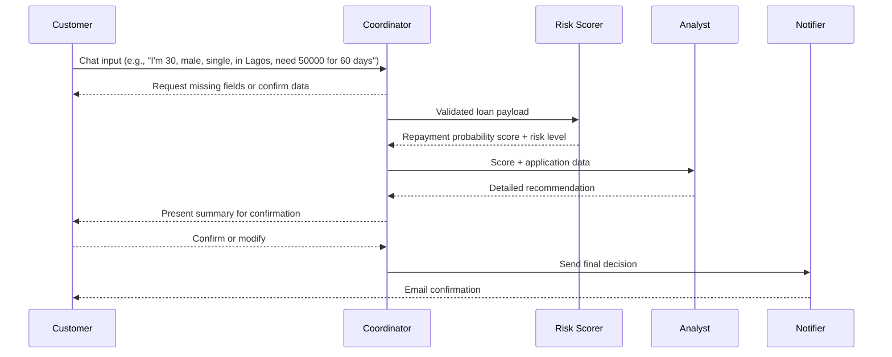

# Agentic Loan Officer

A multi-agent AI system for processing loan applications in Nigeria, featuring natural language processing, risk assessment, recommendation generation, and email communication. Built with Python, Gradio, and various AI and messaging APIs, it provides an interactive interface for users to apply for loans.

## Table of Contents
- [Overview](#overview)
- [Agent Roles & Workflow](#agent-roles--workflow)
- [Features](#features)
- [Technical Architecture](#technical-architecture)
- [Setup Guide](#setup-guide)
- [Running the Application](#running-the-application)
- [Usage Guide](#usage-guide)
- [Testing](#testing)
- [Dependencies](#dependencies)
- [Troubleshooting](#troubleshooting)
- [Contributing](#contributing)
- [License](#license)

## Overview
The Agentic Loan Officer automates loan application processing for Nigerian users through a multi-agent system. Agents handle tasks from data collection to sending loan decisions via email. The system uses OpenAI, Anthropic, and Google Gemini for AI tasks, a fine-tuned OpenAI model for risk scoring, and SendGrid for email notifications. Users interact via a Gradio-based web interface, providing loan details in natural language.

## Agent Roles & Workflow
The system comprises four agents:

| Agent | Responsibility | Handoff |
|-------|----------------|---------|
| **Coordinator (Agent 1)** | Engages users via chat, detects loan application intent, collects and validates fields (`age`, `gender`, `marital_status`, `location`, `amount`, `tenure`). | Passes validated data to **Agent 2**. |
| **Risk Scorer (Agent 2)** | Uses a fine-tuned OpenAI model to compute a **repayment probability score** (0-99) and risk level (high, medium, acceptable). | Returns results to **Agent 1**. |
| **Analyst (Agent 3)** | Analyzes Agent 2’s output, providing a detailed recommendation (approve, adjust, decline). | Sends recommendation to **Agent 1** for confirmation. |
| **Notifier (Agent 4)** | Upon confirmation, sends a professional email with the loan decision using SendGrid. | Completes the workflow. |

### Interaction Flow


### Required Payload (Coordinator to Risk Scorer)
```json
{
  "age": 30,
  "gender": "male",
  "marital_status": "single",
  "location": "Lagos",
  "amount": 50000,
  "tenure": 60
}
```

## Features
- **Natural Language Processing**: Extracts loan details using spaCy, regex, and word2number.
- **Data Validation**: Ensures fields meet requirements (e.g., age 19-70, amount ≤ ₦1,000,000).
- **Risk Assessment**: Generates repayment probability scores via a fine-tuned OpenAI model.
- **Loan Recommendation**: Provides detailed approval/rejection recommendations.
- **Email Notifications**: Sends HTML emails via SendGrid.
- **Interactive UI**: Gradio-based web interface.
- **Modular Design**: Extensible agent-based architecture.

## Technical Architecture
- **Language**: Python 3.12+
- **Framework**: Gradio for the web interface
- **AI Models**:
  - OpenAI `gpt-4o-mini` for coordination and NLP
  - Fine-tuned OpenAI model for risk scoring
  - Anthropic, Llama-3.3-70b-versatile and Google Gemini for additional AI tasks
- **Libraries**:
  - `openai`, `anthropic`, `google-genai`: AI model interactions
  - `sendgrid`: Email delivery
  - `spacy`, `word2number`: NLP
  - `gradio`: UI
  - `playwright`, `requests`, `httpx`: Web interactions
- **Tools**:
  - `uv`: Dependency and environment management
  - `pytest`: Unit testing
- **APIs**:
  - OpenAI, Anthropic, Google Gemini, SendGrid

## Setup Guide
1. **Clone the Repository**:
   ```bash
   git clone https://github.com/seunope/agentic-loan-officer.git
   cd agentic-loan-officer
   ```

2. **Install `uv`**:
   ```bash
   pip install uv
   ```

3. **Create a Virtual Environment**:
   ```bash
   uv venv
   source .venv/bin/activate  # On Windows: .venv\Scripts\activate
   ```

4. **Install Dependencies**:
   Install project and development dependencies:
   ```bash
   uv pip install . --group dev
   ```

5. **Configure Environment Variables**:
   Create a `.env` file in the project root:
   ```plaintext
   OPENAI_API_KEY=your_openai_key
   FINE_TUNED_MODEL=your_fine_tuned_model_id
   GOOGLE_API_KEY=your_google_key
   GROQ_API_KEY=your_groq_key
   SENDGRID_API_KEY=your_sendgrid_key
   ANTHROPIC_API_KEY=your_anthropic_key
   ```
   Obtain keys from:
   - [OpenAI](https://platform.openai.com/)
   - [Google Cloud](https://console.cloud.google.com/)
   - [Groq](https://console.groq.com/)
   - [SendGrid](https://app.sendgrid.com/)
   - [Anthropic](https://console.anthropic.com/)

6. **Download spaCy Model**:
   ```bash
   uv run python -m spacy download en_core_web_sm
   ```

## Running the Application
1. **Run with `uv`**:
   ```bash
   uv run python -m src.main
   ```

2. **Access the Interface**:
   - Open the Gradio URL (e.g., `http://127.0.0.1:7860`) in a browser.

3. **Alternative Run Command**:
   If running directly:
   ```bash
   uv run python src/main.py
   ```
   Note: May require `sys.path.append` in `src/main.py` for relative imports (see troubleshooting).

## Usage Guide
1. **Start a Loan Application**:
   - Enter details in the Gradio interface: "I'm 30 years old, male, single, living in Lagos, need a loan of 50,000 for 60 days."
   - The Coordinator Agent prompts for missing or invalid data.

2. **Review and Confirm**:
   - Review the summary of collected fields.
   - Confirm with "yes" or "proceed," or modify with "change" or "edit."

3. **Receive Decision**:
   - After confirmation, the system processes the application and sends a decision email.
   - Provide a valid email address when prompted.

4. **Start a New Application**:
   - Click "Start New Application" to reset.

## Testing
Run unit tests from the project root:
```bash
uv run pytest tests/ -v
```
The `-v` flag provides verbose output. Tests cover:
- Coordinator data collection
- Risk scorer instructions
- Recommendation logic
- Emailer initialization
- Data validation
- NLP extraction

Note: Ensure the project is installed (`uv pip install .`) to make the `src` module available for test imports.


## Troubleshooting
- **ModuleNotFoundError: No module named 'src'**:
  - Run tests from the project root: `uv run pytest tests/`.
  - Ensure the project is installed: `uv pip install .`.
  - Add `pytest.ini` with `python_paths = .` (see Setup Guide).
  - Set `PYTHONPATH`: `export PYTHONPATH=$PYTHONPATH:/path/to/agentic-loan-officer`.
- **Dependency Group Errors**:
  - Use `uv pip install . --group dev` instead of `uv pip install ".[dev]"`.
- **Zsh Globbing Errors**:
  - For commands like `uv pip install ".[dev]"`, use quotes or escape: `uv pip install .\[dev\]`.
- **Relative Import Errors**:
  - Use `uv run python -m src.main`.
  - Or add `sys.path.append(os.path.abspath(os.path.join(os.path.dirname(__file__), '..', '..')))` to `src/main.py`.
- **API Errors**:
  - Verify API keys in `.env`.
  - Check rate limits or permissions.
- **Port Conflicts**:
  - Change port: `uv run python -m src.main --server_port 5000`.
- **Dependency Issues**:
  - Re-sync: `uv pip install . --group dev`.
  - Ensure Python ≥3.12: `uv python 3.12`.
- **NLP Extraction Failures**:
  - Confirm spaCy model: `uv run python -m spacy download en_core_web_sm`.

## Contributing
1. Fork the repository.
2. Create a feature branch: `git checkout -b feature/your-feature`.
3. Commit changes: `git commit -m "Add your feature"`.
4. Push: `git push origin feature/your-feature`.
5. Open a pull request.

Include tests and follow PEP 8 guidelines.

## License
MIT License. See `LICENSE` file.