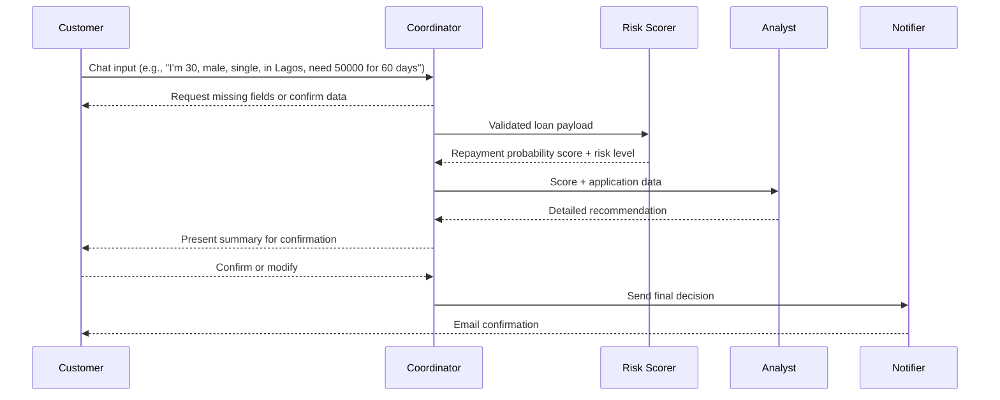

# Agentic Loan Officer

A multi-agent AI system for processing loan applications in Nigeria, featuring natural language processing, risk assessment, recommendation generation, and email communication. Built with Python, Gradio, and various AI and messaging APIs, it provides an interactive interface for users to apply for loans.

## Table of Contents
- [Overview](#overview)
- [Agent Roles & Workflow](#agent-roles--workflow)
- [Features](#features)
- [Technical Architecture](#technical-architecture)
- [Setup Guide](#setup-guide)
- [Running the Application](#running-the-application)
- [Usage Guide](#usage-guide)
- [Testing](#testing)
- [Project Structure](#project-structure)
- [Dependencies](#dependencies)
- [Troubleshooting](#troubleshooting)
- [Contributing](#contributing)
- [License](#license)

## Overview
The Agentic Loan Officer is designed to streamline loan application processing for Nigerian users. It uses a multi-agent system where each agent handles a specific task, from collecting user data to sending final loan decisions via email. The system leverages OpenAI for natural language understanding, a fine-tuned model for risk scoring, and SendGrid for email notifications. Users interact through a Gradio-based web interface, providing loan details in natural language, which the system processes and validates.

## Agent Roles & Workflow
The system comprises four specialized agents that collaborate to process loan applications:

| Agent | Responsibility | Handoff |
|-------|----------------|---------|
| **Coordinator (Agent 1)** | Engages with the user via chat, detects loan application intent, collects and validates required fields (`age`, `gender`, `marital_status`, `location`, `amount`, `tenure`). | Passes validated data to **Agent 2** for risk scoring. |
| **Risk Scorer (Agent 2)** | Uses a fine-tuned OpenAI model to compute a **repayment probability score** (0-99) and risk level (high, medium, acceptable). | Returns results to **Agent 1**. |
| **Analyst (Agent 3)** | Analyzes Agent 2’s output, providing a detailed loan recommendation (approve, adjust, decline) with explanations. | Sends recommendation back to **Agent 1** for user confirmation. |
| **Notifier (Agent 4)** | Upon user confirmation, formats and sends a professional email with the loan decision using SendGrid. | Completes the workflow. |

### Interaction Flow


### Required Payload (Coordinator to Risk Scorer)
```json
{
  "age": 30,
  "gender": "male",
  "marital_status": "single",
  "location": "Lagos",
  "amount": 50000,
  "tenure": 60
}
```

## Features
- **Natural Language Processing**: Extracts loan application details from user input using spaCy and custom regex patterns.
- **Data Validation**: Ensures all fields meet requirements (e.g., age 19-70, amount ≤ ₦1,000,000, tenure 7-180 days) using Pydantic.
- **Risk Assessment**: Generates a repayment probability score (0-99) and risk level (high, medium, acceptable) via a fine-tuned OpenAI model.
- **Loan Recommendation**: Provides detailed approval/rejection recommendations based on risk analysis.
- **Email Notifications**: Sends professional HTML emails with loan decisions using SendGrid.
- **Interactive UI**: Gradio-based web interface for user-friendly interaction.
- **Modular Design**: Extensible agent-based architecture for easy integration of new features.

## Technical Architecture
- **Language**: Python 3.12+
- **Framework**: Gradio for the web interface
- **AI Models**:
  - OpenAI `gpt-4o-mini` for coordination and general NLP tasks
  - Fine-tuned OpenAI model for repayment probability scoring
  - Gemini (via Google API) for email subject and HTML conversion
- **Libraries**:
  - `openai`: For API interactions with OpenAI and Groq
  - `sendgrid`: For sending emails
  - `spacy`: For NLP and entity extraction
  - `pydantic`: For data validation
  - `word2number`: For converting text numbers to integers
  - `aiohttp`: For asynchronous HTTP requests
- **Tools**:
  - `uv`: For dependency and virtual environment management
  - `pytest`: For unit testing
- **APIs**:
  - OpenAI API (for NLP and fine-tuned model)
  - Google Gemini API (for email formatting)
  - Groq API (for additional model support)
  - SendGrid API (for email delivery)

## Setup Guide
1. **Clone the Repository**:
   ```bash
   git clone https://github.com/yourusername/agentic-loan-officer.git
   cd agentic-loan-officer
   ```

2. **Install `uv`**:
   Install `uv` if not already present:
   ```bash
   pip install uv
   ```

3. **Create a Virtual Environment**:
   ```bash
   uv venv
   source .venv/bin/activate  # On Windows: .venv\Scripts\activate
   ```

4. **Install Dependencies**:
   ```bash
   uv pip sync requirements.txt
   ```
   Or, if using `pyproject.toml`:
   ```bash
   uv pip install .
   ```

5. **Configure Environment Variables**:
   Create a `.env` file in the project root:
   ```plaintext
   OPENAI_API_KEY=your_openai_key
   FINE_TUNED_MODEL=your_fine_tuned_model_id
   GOOGLE_API_KEY=your_google_key
   GROQ_API_KEY=your_groq_key
   SENDGRID_API_KEY=your_sendgrid_key
   ```
   Obtain keys from:
   - [OpenAI](https://platform.openai.com/)
   - [Google Cloud](https://console.cloud.google.com/)
   - [Groq](https://console.groq.com/)
   - [SendGrid](https://app.sendgrid.com/)

6. **Download spaCy Model**:
   ```bash
   uv run python -m spacy download en_core_web_sm
   ```

## Running the Application
1. **Run with `uv`**:
   ```bash
   uv run python -m src.main
   ```

2. **Access the Interface**:
   - A Gradio URL (e.g., `http://127.0.0.1:7860`) will appear in the terminal.
   - Open it in a browser to start interacting.

3. **Alternative Run Command**:
   If you prefer running directly (less recommended):
   ```bash
   uv run python src/main.py
   ```
   Note: This may require adding `sys.path.append` to `src/main.py` for relative imports (see troubleshooting).

## Usage Guide
1. **Start a Loan Application**:
   - In the Gradio chat interface, provide details like: "I'm 30 years old, male, single, living in Lagos, need a loan of 50000 for 60 days."
   - The Coordinator Agent will extract and validate fields, prompting for missing or invalid data.

2. **Review and Confirm**:
   - Once all fields are collected, the system presents a summary (e.g., age, gender, amount).
   - Confirm with words like "yes" or "proceed," or modify with "change" or "edit."

3. **Receive Decision**:
   - After confirmation, the system processes the application, generates a risk score, and provides a recommendation.
   - Enter a valid email address when prompted to receive the final decision via email.

4. **Start a New Application**:
   - Click "Start New Application" in the interface to reset and begin anew.

## Testing
Run unit tests to verify functionality:
```bash
uv run pytest tests/
```
Tests cover:
- Coordinator data collection
- Risk scorer instructions
- Recommendation logic
- Emailer initialization
- Data validation
- NLP extraction

## Project Structure
```
agentic-loan-officer/
├── src/
│   ├── agents/
│   │   ├── __init__.py
│   │   ├── coordinator.py
│   │   ├── repayment_predictor.py
│   │   ├── recommendation.py
│   │   └── emailer.py
│   ├── models/
│   │   ├── __init__.py
│   │   └── validation_models.py
│   ├── utils/
│   │   ├── __init__.py
│   │   ├── agent_prompt.py
│   │   └── nl_extractor.py
│   ├── __init__.py
│   └── main.py
├── tests/
│   ├── __init__.py
│   ├── test_coordinator.py
│   ├── test_repayment_predictor.py
│   ├── test_recommendation.py
│   ├── test_emailer.py
│   ├── test_validation_models.py
│   └── test_nl_extractor.py
├── .env
├── requirements.txt
├── README.md
├── setup.py
└── pyproject.toml
```

## Dependencies
Key dependencies (see `requirements.txt` or `pyproject.toml`):
- `python-dotenv==1.0.1`
- `openai==1.35.10`
- `sendgrid==6.11.0`
- `pydantic==2.8.2`
- `spacy==3.7.5`
- `word2number==1.1`
- `gradio==4.42.0`
- `aiohttp==3.10.5`

## Troubleshooting
- **Relative Import Errors**:
  - Run as a module: `uv run python -m src.main`.
  - Alternatively, add `sys.path.append(os.path.abspath(os.path.join(os.path.dirname(__file__), '..', '..')))` to `src/main.py`.
- **API Errors**:
  - Verify API keys in `.env` are valid.
  - Check API rate limits or permissions (e.g., SendGrid email sending).
- **Port Conflicts**:
  - Change Gradio port: `uv run python -m src.main --server_port 5000`.
- **Dependency Issues**:
  - Re-sync: `uv pip sync requirements.txt`.
  - Ensure Python ≥3.12: `uv python 3.12`.
- **NLP Extraction Failures**:
  - Confirm spaCy model: `uv run python -m spacy download en_core_web_sm`.
- **Syntax Errors**:
  - Check modified files (e.g., `emailer.py`, `coordinator.py`) for typos.
  - Run `uv run python -m compileall src/` to catch syntax issues.

## Contributing
1. Fork the repository.
2. Create a feature branch: `git checkout -b feature/your-feature`.
3. Commit changes: `git commit -m "Add your feature"`.
4. Push to the branch: `git push origin feature/your-feature`.
5. Open a pull request.

Please include tests for new features and follow PEP 8 style guidelines.

## License
MIT License. See `LICENSE` file for details.